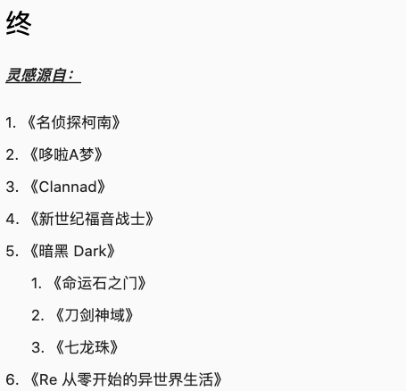

<!-- @format -->

# Draft View

 

A Draft JS renderer written in Dart!

This project supports rendering Draft JS object in Flutter natively! It will convert draft js object into Flutter Rich Textspan!

It is implemented in a plugable design so that you can create your own plugin easily.

## Supported Plugins

- Image Plugin
- List Plugin
- Blockquote Plugin
- PostSettings Plugin. [Example](https://blog.sirileepage.com/#/post/39)
- Header Plugin
- Basic Text Plugin

## Demo

1. Header, Postsettings, BlockQuote support
   

2. Image and image's caption support
   

3. Full screen image support (when clicked)
   

4. Text inline style and nested list support
   
